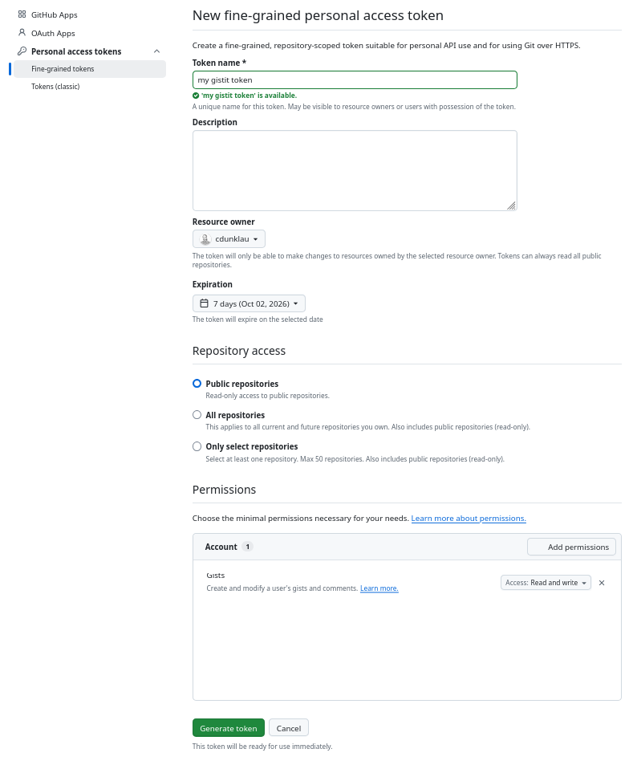

GistIt
######

Create Gists_ from the command line.

Supports Python 3.10+. Requires the Requests_ library.

.. _Gists: https://gist.github.com/
.. _Requests: https://requests.readthedocs.io/

Features
========

-   Public/Private Gists.
-   Filenames with path context (optional).

Usage
=====

Set up a fine-grained `personal access token`_ on your GitHub account. Set the
expiration short, as they're easy to make. A shorter expiration is more secure.
Set the token to public-only repositories, and add a read and write permission
for only Gists. Copy the token into ``/home/$USER/.gistit_token``.

.. _personal access token: https://github.com/settings/personal-access-tokens

General usage::

    usage: gistit.py [-h] [--token TOKEN] {create} ...

    positional arguments:
      {create}              Available commands
        create              Create new gist

    options:
      -h, --help            show this help message and exit
      --token TOKEN, -t TOKEN
                            Path to token file

Create command::

    usage: gistit.py create [-h] [--description DESCRIPTION] [--public]
                            [--no-contextual]
                            file [file ...]

    positional arguments:
      file                  File to upload

    options:
      -h, --help            show this help message and exit
      --description DESCRIPTION, -d DESCRIPTION
                            Gist description
      --public, -p          Create as public gist
      --no-contextual, -C   Use normal filenames, without path context

Development Setup
=================

Make sure you have Python 3.10 or higher, and create a venv with the dev
dependencies::

    python3 --version
    python3 -m venv venv
    venv/bin/pip install --upgrade pip
    venv/bin/pip install --group dev

Run tox for tests and formatting::

    venv/bin/tox
